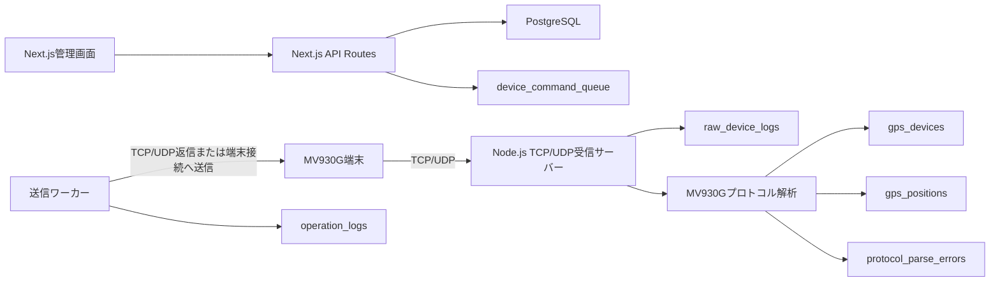

# MV930G GPS管理プラットフォーム MVP設計

## 目的

株式会社エコループの車・バイク自社ローン販売で、GPS端末 `MV930G` を取り付けた車両、顧客、端末、現在位置、通信ログ、遠隔制御操作を管理するWeb管理システムを構築する。

MV930GはTCP/UDPクライアントとして当社サーバーへデータを送信し、当社プラットフォームは受信サーバーとして動作する。プロトコル解析が未完成でも生データを失わないことをMVPの最優先条件にする。

## 参照資料の配置

MV930Gのプロトコル資料とマニュアルは、後続実装時に以下へ保存する。

- `docs/mv930g/protocol.md`
- `docs/mv930g/manual.md`
- `docs/mv930g/samples/`

実機到着前は、サンプル受信データを `docs/mv930g/samples/*.txt` または `*.json` として保存し、モック受信テストから利用する。

## MVP範囲

MVPで実装する機能:

- 管理者ログイン
- 顧客管理
- 車両管理
- 端末管理
- GPS最新位置と履歴
- Google Maps APIを使った地図表示
- TCP/UDP受信サーバー
- rawログ保存
- Terminal Authentication、Heartbeat、Location Information Reportの初期解析
- 遠隔制御コマンドの登録、確認、実行ログ保存
- サンプルデータによるモック受信テスト

MVPで後回しにする機能:

- ジオフェンス
- 支払いシステムとの自動連携
- SMS通知、LINE通知
- 複数権限ロールの細分化
- 端末ファームウェア管理
- 高度な走行分析

## システム構成



## DB設計

DDLは `supabase/mv930g-schema.sql` に分離する。既存の `profiles` を管理者ユーザーとして参照し、GPS管理系テーブルは `gps_` プレフィックスを付ける。

### customers

テーブル名: `gps_customers`

| カラム | 型 | 内容 |
| --- | --- | --- |
| id | uuid | 主キー |
| full_name | text | 氏名 |
| phone | text | 電話番号 |
| address | text | 住所 |
| email | text | メール |
| contract_type | text | `car` または `bike` |
| contract_status | text | `screening`, `active`, `overdue`, `paid_off`, `cancelled` |
| notes | text | 管理メモ |
| created_at | timestamptz | 作成日時 |
| updated_at | timestamptz | 更新日時 |

### vehicles

テーブル名: `gps_vehicles`

| カラム | 型 | 内容 |
| --- | --- | --- |
| id | uuid | 主キー |
| customer_id | uuid | 顧客ID |
| vehicle_type | text | `car` または `bike` |
| maker | text | メーカー |
| model_name | text | 車種 |
| model_year | integer | 年式 |
| vin | text | 車台番号 |
| license_plate | text | ナンバー |
| status | text | `active`, `sold`, `returned`, `inactive` |
| created_at | timestamptz | 作成日時 |
| updated_at | timestamptz | 更新日時 |

### devices

テーブル名: `gps_devices`

| カラム | 型 | 内容 |
| --- | --- | --- |
| id | uuid | 主キー |
| vehicle_id | uuid | 紐付け車両 |
| device_name | text | 端末名 |
| imei | text | IMEI、一意 |
| device_identifier | text | Device ID、一意 |
| sim_phone_number | text | SIM電話番号 |
| iccid | text | ICCID |
| connection_status | text | `online` または `offline` |
| last_seen_at | timestamptz | 最終通信日時 |
| last_raw_log_id | uuid | 最終rawログ |
| created_at | timestamptz | 作成日時 |
| updated_at | timestamptz | 更新日時 |

### positions

テーブル名: `gps_positions`

| カラム | 型 | 内容 |
| --- | --- | --- |
| id | uuid | 主キー |
| device_id | uuid | 端末ID |
| vehicle_id | uuid | 車両ID |
| raw_log_id | uuid | 元rawログ |
| latitude | numeric(10,7) | 緯度 |
| longitude | numeric(10,7) | 経度 |
| speed_kmh | numeric(8,2) | 速度 |
| heading_degrees | numeric(6,2) | 方位 |
| acc_status | text | `on`, `off`, `unknown` |
| relay_status | text | `cut`, `restored`, `unknown` |
| vehicle_voltage | numeric(6,2) | 車両電圧 |
| located_at | timestamptz | 端末側位置時刻 |
| received_at | timestamptz | サーバー受信日時 |
| created_at | timestamptz | 作成日時 |

最新位置は `gps_latest_positions` ビューで取得する。

### raw logs

テーブル名: `raw_device_logs`

| カラム | 型 | 内容 |
| --- | --- | --- |
| id | uuid | 主キー |
| transport | text | `tcp` または `udp` |
| remote_address | text | 送信元IP |
| remote_port | integer | 送信元ポート |
| local_port | integer | 受信ポート |
| device_identifier | text | 解析できたDevice ID |
| imei | text | 解析できたIMEI |
| packet_type | text | `terminal_authentication`, `heartbeat`, `location_report`, `unknown` |
| raw_hex | text | 生データHEX |
| raw_text | text | テキストとして読める場合の生データ |
| parsed_payload | jsonb | 解析結果 |
| parse_status | text | `pending`, `parsed`, `failed`, `unsupported` |
| received_at | timestamptz | 受信日時 |
| created_at | timestamptz | 作成日時 |

通信を受けた時点で必ずこのテーブルへ保存し、解析は保存後に実行する。

### protocol parse errors

テーブル名: `protocol_parse_errors`

解析失敗や未対応パケットを記録する。rawログは削除せず、失敗理由だけ別テーブルに保存する。

### operation logs

テーブル名: `operation_logs`

| カラム | 型 | 内容 |
| --- | --- | --- |
| id | uuid | 主キー |
| actor_profile_id | uuid | 実行者 |
| device_id | uuid | 対象端末 |
| vehicle_id | uuid | 対象車両 |
| operation_type | text | `safe_cut`, `restore`, `arm`, `disarm` |
| confirmation_text | text | 確認画面で表示した文言 |
| reason | text | 操作理由 |
| request_payload | jsonb | 送信予定コマンド |
| result_status | text | `queued`, `sent`, `acknowledged`, `failed`, `cancelled` |
| result_message | text | 結果詳細 |
| created_at | timestamptz | 作成日時 |
| executed_at | timestamptz | 実送信日時 |

遠隔制御は必ず確認画面を通し、キャンセルもログに残す。

### command queue

テーブル名: `device_command_queue`

遠隔制御コマンドの送信待ち、送信済み、ACK待ち、失敗を管理する。受信サーバーとは別に送信ワーカーを立て、端末通信仕様に合わせてTCP/UDPで送信する。

## 画面構成

### `/admin/gps`

GPS管理ダッシュボード。

- オンライン端末数
- オフライン端末数
- 延滞中顧客数
- 最新受信ログ件数
- 地図上の現在地一覧
- 最近の遠隔操作履歴

### `/admin/gps/customers`

顧客一覧。

- 氏名、電話番号、契約種別、契約ステータスで検索
- 顧客作成、編集
- 顧客詳細への導線

### `/admin/gps/customers/[id]`

顧客詳細。

- 顧客情報
- 紐付け車両
- 紐付け端末
- 最新位置
- 操作ログ

### `/admin/gps/vehicles`

車両一覧。

- 車両区分、メーカー、車種、ナンバー、顧客名で検索
- 車両作成、編集
- 現在地を地図で開く

### `/admin/gps/vehicles/[id]`

車両詳細。

- 車両情報
- 顧客情報
- 端末情報
- 最新位置
- 位置履歴タイムライン
- 遠隔制御ボタン

### `/admin/gps/devices`

端末一覧。

- 端末名、IMEI、Device ID、SIM電話番号、ICCIDで検索
- オンライン、オフラインで絞り込み
- 車両への紐付け

### `/admin/gps/devices/[id]`

端末詳細。

- 端末情報
- 接続状態
- 最終通信日時
- rawログ
- 解析済み位置履歴
- 遠隔制御履歴

### `/admin/gps/map`

地図表示。

- Google Maps APIで車両の最新位置を表示
- 契約ステータス、端末状態、車両区分で絞り込み
- マーカークリックで顧客、車両、端末、最終通信日時を表示

### `/admin/gps/vehicles/[id]/history`

位置履歴。

- 日付範囲指定
- 時系列リスト
- 地図上の軌跡表示
- 速度、ACC、リレー状態、電圧を表示

### `/admin/gps/operations/[deviceId]/confirm`

遠隔制御確認画面。

- 操作種別
- 対象顧客、車両、端末
- リスク説明
- 操作理由入力
- 管理者ログイン中ユーザー表示
- 確認チェック必須

燃料/電気回路カットは `safe_cut` を標準にし、即時危険を避ける仕様を前提にする。

### `/admin/gps/mock`

実機到着前のモックテスト画面。

- サンプルデータ選択
- TCPまたはUDPとして模擬投入
- rawログ保存結果
- 解析結果
- 最新位置反映の確認

## API設計

管理APIは管理者のみ許可する。既存の `profiles.role = 'admin'` を利用する。

### 認証

- `GET /api/admin/gps/me`
  - 管理者セッション確認

### 顧客

- `GET /api/admin/gps/customers`
  - クエリ: `q`, `contractType`, `contractStatus`, `page`, `limit`
- `POST /api/admin/gps/customers`
- `GET /api/admin/gps/customers/:id`
- `PATCH /api/admin/gps/customers/:id`
- `DELETE /api/admin/gps/customers/:id`

### 車両

- `GET /api/admin/gps/vehicles`
  - クエリ: `q`, `vehicleType`, `customerId`, `page`, `limit`
- `POST /api/admin/gps/vehicles`
- `GET /api/admin/gps/vehicles/:id`
- `PATCH /api/admin/gps/vehicles/:id`
- `DELETE /api/admin/gps/vehicles/:id`
- `GET /api/admin/gps/vehicles/:id/positions`
  - クエリ: `from`, `to`, `limit`

### 端末

- `GET /api/admin/gps/devices`
  - クエリ: `q`, `connectionStatus`, `vehicleId`, `page`, `limit`
- `POST /api/admin/gps/devices`
- `GET /api/admin/gps/devices/:id`
- `PATCH /api/admin/gps/devices/:id`
- `DELETE /api/admin/gps/devices/:id`
- `GET /api/admin/gps/devices/:id/raw-logs`
- `GET /api/admin/gps/devices/:id/positions`

### 地図

- `GET /api/admin/gps/map/latest`
  - 最新位置一覧を返す
  - クエリ: `contractStatus`, `connectionStatus`, `vehicleType`

### 遠隔制御

- `POST /api/admin/gps/devices/:id/operations/preview`
  - 確認画面用の操作内容を生成
  - body: `{ operationType }`
- `POST /api/admin/gps/devices/:id/operations`
  - 確認後にコマンドをキューへ登録
  - body: `{ operationType, reason, confirmed: true }`
- `GET /api/admin/gps/operations`
  - 操作ログ一覧
- `GET /api/admin/gps/operations/:id`
  - 操作詳細

### rawログと解析

- `GET /api/admin/gps/raw-logs`
  - クエリ: `deviceId`, `packetType`, `parseStatus`, `from`, `to`, `page`, `limit`
- `GET /api/admin/gps/raw-logs/:id`
- `POST /api/admin/gps/raw-logs/:id/reparse`

### モックテスト

- `GET /api/admin/gps/mock/samples`
- `POST /api/admin/gps/mock/ingest`
  - body: `{ transport, sampleName }` または `{ transport, rawHex, rawText }`
  - rawログ保存、解析、位置反映まで実行

## TCP/UDP受信サーバー構成

Next.jsとは別プロセスのNode.js/TypeScriptサーバーとして実装する。Vercelなどのサーバーレス環境ではTCP/UDP待受に向かないため、VPS、専用サーバー、または常駐可能なコンテナで稼働させる。

想定ディレクトリ:

- `server/mv930g/index.ts`
- `server/mv930g/tcp-server.ts`
- `server/mv930g/udp-server.ts`
- `server/mv930g/parser.ts`
- `server/mv930g/command-worker.ts`
- `server/mv930g/mock-ingest.ts`

環境変数:

```bash
MV930G_TCP_PORT=9300
MV930G_UDP_PORT=9300
MV930G_PUBLIC_HOST=gps.example.com
SUPABASE_URL=
SUPABASE_SERVICE_ROLE_KEY=
```

受信処理の順序:

1. TCP/UDPでデータ受信
2. 送信元IP、ポート、ローカルポート、生データを記録
3. `raw_device_logs` に `parse_status = 'pending'` で保存
4. 保存後にプロトコル解析
5. 解析結果を `raw_device_logs.parsed_payload` に保存
6. 端末を特定できた場合は `gps_devices.last_seen_at` と `connection_status` を更新
7. 位置情報の場合は `gps_positions` に保存
8. 未対応または失敗時は `protocol_parse_errors` に保存

rawログ保存前に解析エラーで処理を止めてはいけない。

## プロトコル解析方針

初期対応パケット:

- Terminal Authentication
- Heartbeat
- Location Information Report

パーサーの戻り値:

```ts
type ParsedMv930gPacket = {
  packetType: "terminal_authentication" | "heartbeat" | "location_report" | "unknown";
  deviceIdentifier?: string;
  imei?: string;
  occurredAt?: string;
  position?: {
    latitude: number;
    longitude: number;
    speedKmh?: number;
    headingDegrees?: number;
    accStatus?: "on" | "off" | "unknown";
    relayStatus?: "cut" | "restored" | "unknown";
    vehicleVoltage?: number;
  };
  payload: Record<string, unknown>;
  responseHex?: string;
};
```

Terminal AuthenticationやHeartbeatで端末仕様上レスポンスが必要な場合は、パーサーが `responseHex` を返し、受信サーバーが同じTCP接続またはUDP送信元へ返信する。

## 遠隔制御設計

操作種別:

- `safe_cut`: 燃料/電気回路の安全カット
- `restore`: 復旧
- `arm`: ARM
- `disarm`: DISARM

制約:

- 操作できるのは管理者のみ
- 操作前に確認画面を必ず表示する
- 操作理由を必須にする
- 操作開始、キュー登録、送信、ACK、失敗、キャンセルを `operation_logs` に保存する
- `safe_cut` を標準操作にし、危険な即時停止コマンドはMVPでは実装しない
- 端末プロトコル資料でコマンド形式を確認するまでは、送信ワーカーはモック送信またはキュー登録までに留める

## Google Maps設計

環境変数:

```bash
NEXT_PUBLIC_GOOGLE_MAPS_API_KEY=
```

MVP表示:

- 最新位置マーカー
- 車・バイクでアイコンを分ける
- オンライン、オフラインで色を分ける
- 位置履歴はポリラインで表示
- マーカー詳細に顧客、車両、端末、速度、ACC、電圧、受信日時を表示

## モックテスト

実機到着前は以下をテストする。

- サンプルrawデータが `raw_device_logs` に保存される
- Terminal Authenticationが端末識別情報を抽出する
- Heartbeatが `last_seen_at` を更新する
- Location Information Reportが `gps_positions` を作成する
- 解析不能データがrawログとして残り、`protocol_parse_errors` に記録される
- 遠隔制御は確認画面とログ保存まで動作する

## 実装順序

1. `supabase/mv930g-schema.sql` をSupabase SQL Editorで適用
2. TypeScript型とGPS管理用ライブラリを追加
3. 管理画面の顧客、車両、端末CRUDを追加
4. rawログ一覧とモック投入APIを追加
5. MV930Gパーサーの最小実装を追加
6. TCP/UDP受信サーバーを追加
7. GPS最新位置と履歴APIを追加
8. Google Maps画面を追加
9. 遠隔制御の確認画面、キュー、ログを追加
10. 実機受信データでプロトコル解析を調整
