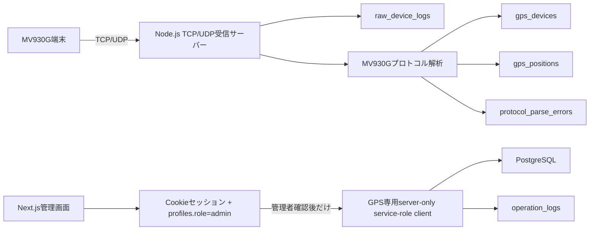

# MV930G GPS管理プラットフォーム MVP設計

## 目的

株式会社エコループの車・バイク自社ローン販売で、GPS端末 `MV930G` を取り付けた車両、顧客、端末、現在位置、通信ログを管理するWeb管理システムを構築する。

MV930GはTCP/UDPクライアントとして当社サーバーへデータを送信し、当社プラットフォームは受信サーバーとして動作する。プロトコル解析が未完成でも生データを失わないことをMVPの最優先条件にする。

Phase 1では、リレーによる燃料・電源・エンジン遮断、SMS送信、GPS端末への任意コマンド送信を完全に無効化する。操作ボタン・送信API・コマンドワーカーは提供しない。

## 参照資料の配置

MV930Gのプロトコル資料とマニュアルは、後続実装時に以下へ保存する。

- `docs/mv930g/protocol.md`
- `docs/mv930g/manual.md`
- `docs/mv930g/samples/`

実機到着前は、サンプル受信データを `docs/mv930g/samples/*.txt` または `*.json` として保存し、モック受信テストから利用する。

## MVP範囲

MVPで実装する機能:

- 管理者ログイン
- 顧客管理
- 車両管理
- 端末管理
- GPS最新位置と履歴
- Google Maps APIを使った地図表示
- TCP/UDP受信サーバー
- rawログ保存
- Terminal Authentication、Heartbeat、Location Information Reportの初期解析
- 過去のアラーム・操作ログの参照
- サンプルデータによるモック受信テスト

MVPで後回しにする機能:

- ジオフェンス
- 支払いシステムとの自動連携
- SMS通知、LINE通知
- 複数権限ロールの細分化
- 端末ファームウェア管理
- 高度な走行分析

## システム構成


```mermaid
flowchart LR
  MV930G["MV930G端末"] -->|"TCP/UDP"| Receiver["Node.js TCP/UDP受信サーバー"]
  Receiver --> RawLogs["raw_device_logs"]
  Receiver --> Parser["MV930Gプロトコル解析"]
  Parser --> Devices["gps_devices"]
  Parser --> Positions["gps_positions"]
  Parser --> Errors["protocol_parse_errors"]
  Admin["Next.js管理画面"] --> Auth["Cookieセッション + profiles.role=admin"]
  Auth -->|"管理者確認後だけ"| GpsClient["GPS専用server-only service-role client"]
  GpsClient --> DB["PostgreSQL"]
  GpsClient --> OperationLogs["operation_logs"]
```

## DB設計

初期DDLは `supabase/mv930g-schema.sql` に分離する。実Supabaseへ適用する履歴管理対象は
`supabase/migrations/202607290034_create_mv930g_gps_schema.sql` とし、既存の `profiles` は操作履歴の任意参照先としてのみ使用する。
GPS管理系テーブルは `gps_` プレフィックスを付ける。

### customers

テーブル名: `gps_customers`

| カラム | 型 | 内容 |
| --- | --- | --- |
| id | uuid | 主キー |
| full_name | text | 氏名 |
| phone | text | 電話番号 |
| address | text | 住所 |
| email | text | メール |
| contract_type | text | `car` または `bike` |
| contract_status | text | `screening`, `active`, `overdue`, `paid_off`, `cancelled` |
| notes | text | 管理メモ |
| created_at | timestamptz | 作成日時 |
| updated_at | timestamptz | 更新日時 |

### vehicles

テーブル名: `gps_vehicles`

| カラム | 型 | 内容 |
| --- | --- | --- |
| id | uuid | 主キー |
| customer_id | uuid | 顧客ID |
| vehicle_type | text | `car` または `bike` |
| maker | text | メーカー |
| model_name | text | 車種 |
| model_year | integer | 年式 |
| vin | text | 車台番号 |
| license_plate | text | ナンバー |
| status | text | `active`, `sold`, `returned`, `inactive` |
| created_at | timestamptz | 作成日時 |
| updated_at | timestamptz | 更新日時 |

### devices

テーブル名: `gps_devices`

| カラム | 型 | 内容 |
| --- | --- | --- |
| id | uuid | 主キー |
| vehicle_id | uuid | 紐付け車両 |
| device_name | text | 端末名 |
| imei | text | IMEI、一意 |
| device_identifier | text | Device ID、一意 |
| sim_phone_number | text | SIM電話番号 |
| iccid | text | ICCID |
| connection_status | text | `online` または `offline` |
| last_seen_at | timestamptz | 最終通信日時 |
| last_raw_log_id | uuid | 最終rawログ |
| created_at | timestamptz | 作成日時 |
| updated_at | timestamptz | 更新日時 |

### positions

テーブル名: `gps_positions`

| カラム | 型 | 内容 |
| --- | --- | --- |
| id | uuid | 主キー |
| device_id | uuid | 端末ID |
| vehicle_id | uuid | 車両ID |
| raw_log_id | uuid | 元rawログ |
| latitude | numeric(10,7) | 緯度 |
| longitude | numeric(10,7) | 経度 |
| speed_kmh | numeric(8,2) | 速度 |
| heading_degrees | numeric(6,2) | 方位 |
| acc_status | text | `on`, `off`, `unknown` |
| relay_status | text | `cut`, `restored`, `unknown` |
| vehicle_voltage | numeric(6,2) | 車両電圧 |
| located_at | timestamptz | 端末側位置時刻 |
| received_at | timestamptz | サーバー受信日時 |
| created_at | timestamptz | 作成日時 |

最新位置は `gps_latest_positions` ビューで取得する。

### raw logs

テーブル名: `raw_device_logs`

| カラム | 型 | 内容 |
| --- | --- | --- |
| id | uuid | 主キー |
| transport | text | `tcp` または `udp` |
| remote_address | text | 送信元IP |
| remote_port | integer | 送信元ポート |
| local_port | integer | 受信ポート |
| device_identifier | text | 解析できたDevice ID |
| imei | text | 解析できたIMEI |
| packet_type | text | `terminal_authentication`, `heartbeat`, `location_report`, `unknown` |
| raw_hex | text | 生データHEX |
| raw_text | text | テキストとして読める場合の生データ |
| parsed_payload | jsonb | 解析結果 |
| parse_status | text | `pending`, `parsed`, `failed`, `unsupported` |
| received_at | timestamptz | 受信日時 |
| created_at | timestamptz | 作成日時 |

通信を受けた時点で必ずこのテーブルへ保存し、解析は保存後に実行する。

### protocol parse errors

テーブル名: `protocol_parse_errors`

解析失敗や未対応パケットを記録する。rawログは削除せず、失敗理由だけ別テーブルに保存する。

### operation logs

テーブル名: `operation_logs`

| カラム | 型 | 内容 |
| --- | --- | --- |
| id | uuid | 主キー |
| actor_profile_id | uuid | 実行者 |
| device_id | uuid | 対象端末 |
| vehicle_id | uuid | 対象車両 |
| operation_type | text | キャンセル済み端末操作、または顧客・車両・端末の登録・編集・無効化 |
| confirmation_text | text | 確認画面で表示した文言 |
| reason | text | 操作理由 |
| request_payload | jsonb | 送信せず保存する操作メタデータ |
| result_status | text | 端末操作は`cancelled`、管理データ変更監査は`queued`, `acknowledged`, `failed` |
| result_message | text | 結果詳細 |
| created_at | timestamptz | 作成日時 |
| executed_at | timestamptz | 端末操作ではNULL、管理データ変更成功時だけ設定 |

Phase 1では遠隔制御を行わず、端末操作はキャンセル済み履歴だけを残す。顧客・車両・GPS端末の変更は、
変更前に`queued`監査行を作成し、成功時に`acknowledged`、失敗時に`failed`へ更新する。
監査payloadには対象種別・操作種別・内部UUIDだけを保存し、氏名、IMEI、端末ID、Cookie、JWT、秘密鍵は保存しない。

### command queue

テーブル名: `device_command_queue`

Phase 1では送信キューとして使用しない。既存コードとの構造互換性を保つため、キャンセル済み監査行だけを保存できる閉じたテーブルとして定義する。

- `status = 'cancelled'`
- `attempts = 0`
- `command_hex`, `sent_at`, `acknowledged_at` は常に `NULL`
- `RELAY,1#`, `RELAY,2#`, `safe_cut`, `restore` はCHECK制約で拒否
- anon・authenticatedからの権限は付与しない
- 送信ワーカーは作成しない

## 画面構成

### `/admin/gps`

GPS管理ダッシュボード。

- オンライン端末数
- オフライン端末数
- 延滞中顧客数
- 最新受信ログ件数
- 地図上の現在地一覧
- 最近の遠隔操作履歴

### `/admin/gps/customers`

顧客一覧。

- 氏名、電話番号、契約種別、契約ステータスで検索
- 顧客作成、編集
- 顧客詳細への導線

### `/admin/gps/customers/[id]`

顧客詳細。

- 顧客情報
- 紐付け車両
- 紐付け端末
- 最新位置
- 操作ログ

### `/admin/gps/vehicles`

車両一覧。

- 車両区分、メーカー、車種、ナンバー、顧客名で検索
- 車両作成、編集
- 現在地を地図で開く

### `/admin/gps/vehicles/[id]`

車両詳細。

- 車両情報
- 顧客情報
- 端末情報
- 最新位置
- 位置履歴タイムライン
- 過去のキャンセル済み操作履歴
- リレー・端末コマンド操作ボタンは表示しない

### `/admin/gps/devices`

端末一覧。

- 端末名、IMEI、Device ID、SIM電話番号、ICCIDで検索
- オンライン、オフラインで絞り込み
- 車両への紐付け

### `/admin/gps/devices/[id]`

端末詳細。

- 端末情報
- 接続状態
- 最終通信日時
- rawログ
- 解析済み位置履歴
- 過去のキャンセル済み操作履歴

### `/admin/gps/map`

地図表示。

- Google Maps APIで車両の最新位置を表示
- 契約ステータス、端末状態、車両区分で絞り込み
- マーカークリックで顧客、車両、端末、最終通信日時を表示

### `/admin/gps/vehicles/[id]/history`

位置履歴。

- 日付範囲指定
- 時系列リスト
- 地図上の軌跡表示
- 速度、ACC、リレー状態、電圧を表示

### `/admin/gps/operations/[deviceId]/confirm`

Phase 1では提供しない。リレー・燃料・電源・エンジン遮断や端末コマンドの確認画面、操作ボタン、送信APIは作成しない。

### `/admin/gps/mock`

実機到着前のモックテスト画面。

- サンプルデータ選択
- TCPまたはUDPとして模擬投入
- rawログ保存結果
- 解析結果
- 最新位置反映の確認

## API設計

管理APIは管理者のみ許可する。既存の `profiles.role = 'admin'` を利用する。

### 認証

- `GET /api/admin/gps/me`
  - 管理者セッション確認

### 顧客

- `GET /api/admin/gps/customers`
  - クエリ: `q`, `contractType`, `contractStatus`, `page`, `limit`
- `POST /api/admin/gps/customers`
- `GET /api/admin/gps/customers/:id`
- `PATCH /api/admin/gps/customers/:id`
- `DELETE /api/admin/gps/customers/:id`

### 車両

- `GET /api/admin/gps/vehicles`
  - クエリ: `q`, `vehicleType`, `customerId`, `page`, `limit`
- `POST /api/admin/gps/vehicles`
- `GET /api/admin/gps/vehicles/:id`
- `PATCH /api/admin/gps/vehicles/:id`
- `DELETE /api/admin/gps/vehicles/:id`
- `GET /api/admin/gps/vehicles/:id/positions`
  - クエリ: `from`, `to`, `limit`

### 端末

- `GET /api/admin/gps/devices`
  - クエリ: `q`, `connectionStatus`, `vehicleId`, `page`, `limit`
- `POST /api/admin/gps/devices`
- `GET /api/admin/gps/devices/:id`
- `PATCH /api/admin/gps/devices/:id`
- `DELETE /api/admin/gps/devices/:id`
- `GET /api/admin/gps/devices/:id/raw-logs`
- `GET /api/admin/gps/devices/:id/positions`

### 地図

- `GET /api/admin/gps/map/latest`
  - 最新位置一覧を返す
  - クエリ: `contractStatus`, `connectionStatus`, `vehicleType`

### 遠隔制御

- `GET /api/admin/gps/operations`
  - 操作ログ一覧
- `GET /api/admin/gps/operations/:id`
  - 操作詳細

Phase 1では書き込み・送信APIを公開しない。`device_command_queue` は既存履歴との互換性のためDB定義を残すが、管理APIの公開リソースには含めない。

### rawログと解析

- `GET /api/admin/gps/raw-logs`
  - クエリ: `deviceId`, `packetType`, `parseStatus`, `from`, `to`, `page`, `limit`
- `GET /api/admin/gps/raw-logs/:id`
- `POST /api/admin/gps/raw-logs/:id/reparse`

### モックテスト

- `GET /api/admin/gps/mock/samples`
- `POST /api/admin/gps/mock/ingest`
  - body: `{ transport, sampleName }` または `{ transport, rawHex, rawText }`
  - rawログ保存、解析、位置反映まで実行

## TCP/UDP受信サーバー構成

Next.jsとは別プロセスのNode.js/TypeScriptサーバーとして実装する。Vercelなどのサーバーレス環境ではTCP/UDP待受に向かないため、VPS、専用サーバー、または常駐可能なコンテナで稼働させる。

想定ディレクトリ:

- `server/mv930g/index.ts`
- `server/mv930g/tcp-server.ts`
- `server/mv930g/udp-server.ts`
- `server/mv930g/parser.ts`
- `server/mv930g/mock-ingest.ts`

環境変数:

```bash
MV930G_TCP_PORT=9300
MV930G_UDP_PORT=9300
MV930G_PUBLIC_HOST=gps.example.com
SUPABASE_URL=
SUPABASE_SERVICE_ROLE_KEY=
```

受信処理の順序:

1. TCP/UDPでデータ受信
2. 送信元IP、ポート、ローカルポート、生データを記録
3. `raw_device_logs` に `parse_status = 'pending'` で保存
4. 保存後にプロトコル解析
5. 解析結果を `raw_device_logs.parsed_payload` に保存
6. 端末を特定できた場合は `gps_devices.last_seen_at` と `connection_status` を更新
7. 位置情報の場合は `gps_positions` に保存
8. 未対応または失敗時は `protocol_parse_errors` に保存

rawログ保存前に解析エラーで処理を止めてはいけない。

## プロトコル解析方針

初期対応パケット:

- Terminal Authentication
- Heartbeat
- Location Information Report

パーサーの戻り値:

```ts
type ParsedMv930gPacket = {
  packetType: "terminal_authentication" | "heartbeat" | "location_report" | "unknown";
  deviceIdentifier?: string;
  imei?: string;
  occurredAt?: string;
  position?: {
    latitude: number;
    longitude: number;
    speedKmh?: number;
    headingDegrees?: number;
    accStatus?: "on" | "off" | "unknown";
    relayStatus?: "cut" | "restored" | "unknown";
    vehicleVoltage?: number;
  };
  payload: Record<string, unknown>;
  responseHex?: string;
};
```

Terminal AuthenticationやHeartbeatで端末仕様上レスポンスが必要な場合は、パーサーが `responseHex` を返し、受信サーバーが同じTCP接続またはUDP送信元へ返信する。

## 遠隔制御設計

Phase 1では遠隔制御を実装しない。

- リレー操作ボタンを表示しない
- リレー・SMS・端末コマンド送信APIを公開しない
- コマンド許可リストは空にする
- `GPS_RELAY_CONTROL_ENABLED` が未設定または `true` でもコード側で拒否する
- `operation_logs`の端末操作用途は過去のキャンセル済み履歴参照だけに限定する
- 顧客・車両・GPS端末の管理操作監査は許可するが、端末コマンドとは別のoperation typeとして保存する

## Google Maps設計

環境変数:

```bash
NEXT_PUBLIC_GOOGLE_MAPS_API_KEY=
```

MVP表示:

- 最新位置マーカー
- 車・バイクでアイコンを分ける
- オンライン、オフラインで色を分ける
- 位置履歴はポリラインで表示
- マーカー詳細に顧客、車両、端末、速度、ACC、電圧、受信日時を表示

## モックテスト

実機到着前は以下をテストする。Web管理画面のデモ機能は`NODE_ENV=development`かつ
`GPS_DEMO_MODE=true`のときだけ利用でき、実DBへ保存しない。

- サンプルrawデータをDBへ保存せず解析できる
- Terminal Authenticationが端末識別情報を抽出する
- Heartbeatが `last_seen_at` を更新する
- Location Information Reportが `gps_positions` を作成する
- 解析不能データがrawログとして残り、`protocol_parse_errors` に記録される
- リレー系コマンドと端末コマンドが拒否される

## 実装順序

1. GPSのサーバー側DBアクセスを、管理者認証後のservice-role専用clientへ切り替える（実装済み）
2. `supabase/migrations/202607290034_create_mv930g_gps_schema.sql` をレビューし、検証済みmigrationとして適用
3. 適用直後に読み取り専用検証SQLを実行
4. TypeScript型とGPS管理用ライブラリを追加
5. 管理画面の顧客、車両、端末CRUDを追加
6. rawログ一覧とモック投入APIを追加
7. MV930Gパーサーの最小実装を追加
8. TCP/UDP受信サーバーを追加
9. GPS最新位置と履歴APIを追加
10. Google Maps画面を追加
11. リレー・端末コマンド拒否ポリシーと通信量表示の基礎を追加
12. 実機受信データでプロトコル解析を調整

## 本番Supabase migration運用

### 対象ファイル

- migration:
  `supabase/migrations/202607290034_create_mv930g_gps_schema.sql`
- 適用前検証:
  `supabase/verify-mv930g-gps-preflight.sql`
- 適用後検証:
  `supabase/verify-mv930g-gps-schema.sql`
- 静的検証:
  `node scripts/validate-mv930g-migration.mjs`

`supabase/mv930g-schema.sql` は初期設計の参照資料として残す。実Supabaseへ直接実行せず、履歴管理対象のmigrationを正とする。

### 適用前チェック

1. Supabase Dashboardでプロジェクトが停止中ではなく `Healthy` であることを確認する。
2. バックアップがないため、GPS 8テーブル・1ビュー、専用関数、専用インデックスの名前が未使用であることを確認する。
3. `supabase/verify-mv930g-gps-preflight.sql` を読み取り専用で実行し、9オブジェクトが未作成であることと、`profiles`、Supabaseロール、PostgreSQL 15以上を確認する。
4. 適用前の `public_non_gps_schema_fingerprint` を保存する。これはスキーマ構造だけの指紋で、業務行データを含まない。
5. Supabase CLIのmigration一覧とdry-runを確認し、GPS migration以外が適用候補に含まれる場合は停止する。
6. GPS管理画面/APIのDB clientが、既存管理者判定成功後に`lib/gps/server-admin-client.ts`のcookieを継承しないservice-role clientを使用していることを確認する。
7. `GPS_DEMO_MODE=false`、`GPS_RELAY_CONTROL_ENABLED=false`、コマンド許可リスト空を確認する。

GPS管理画面、Server Actions、API Routes、データ取得ヘルパーは、Cookieセッションと既存`profiles.role=admin`判定を先に行い、
成功後だけ`lib/gps/server-admin-client.ts`のservice-role clientを生成する。GPS配下にはログインユーザーJWT付きclientによるGPSテーブル照会を残さない。
GPS APIは未ログインを401、非管理者を403としてJSONで拒否し、変更系では同一Originと`application/json`を必須にする。
デモモードでは認証済み管理者へ明示したサンプルだけを返し、service-role clientを生成しない。
既存の `profiles.role` をRLS内から参照するポリシーは、現在の実DB認証構造と安全に統合できる保証がないためmigrationへ追加しない。

### 適用方法

Supabase SQL Editorでmigration本文だけを直接実行しない。migration履歴を維持できるSupabase CLIまたは承認済みCIを使用する。

```bash
supabase migration list
supabase db push --dry-run
```

dry-runに
`202607290034_create_mv930g_gps_schema.sql`
以外の未適用migrationが表示された場合は本番適用を中止する。
特に既存の入札システム用migrationは別プロジェクト向けであり、このSupabaseへ同時適用してはいけない。

dry-run、適用前検証、service-role漏えい検査、最終承認がすべて完了した後だけ、別タスクで本番適用する。

### RLS・権限方針

- 全8テーブルでRLSを有効化し、`FORCE ROW LEVEL SECURITY`も設定する。
- Phase 1では行ポリシーを作らない。ポリシーなしのdefault-denyを採用する。
- anon・authenticated・PUBLICからGPSテーブル、ビュー、専用関数の権限を明示的に剥奪する。
- service-roleには8テーブルの `SELECT`, `INSERT`, `UPDATE`だけを付与し、物理削除権限は付与しない。
- `gps_ingest_nonces`だけは直接テーブル権限を一切付与せず、期限切れ削除・予約・重複判定を封じた`public.mv930g_reserve_ingest_nonce(text)`の`EXECUTE`だけを付与する。
- nonce RPCは`SECURITY DEFINER`、固定`search_path`、スキーマ修飾、boolean戻り値とし、PUBLIC・anon・authenticatedから実行できないようにする。
- 管理画面では既存のサーバー側管理者認証を先に通し、その後だけservice-role clientを生成する。
- service-role keyをブラウザ、ログ、Git、レスポンスへ出さない。
- `gps_latest_positions` は `security_invoker=true` とし、service-roleだけに `SELECT` を付与する。

### リレー・実機通信禁止

- `RELAY,1#`, `RELAY,2#`, `safe_cut`, `restore` をコマンドキューへ登録できない。
- `operation_logs`の端末操作は`cancelled`かつ`executed_at IS NULL`だけを許可する。管理データ変更監査だけは別operation typeで`queued`、`acknowledged`、`failed`を許可する。
- `device_command_queue` はキャンセル済み監査行以外を拒否する。
- 送信ワーカー、SMS、端末コマンドAPI、車両配線、実機通電はPhase 1では使用しない。

### 適用後検証

`supabase/verify-mv930g-gps-schema.sql` を読み取り専用で実行し、以下を確認する。

- 8テーブルと1ビューの種別
- カラム型、nullable、default
- 主キー、外部キー、一意制約、CHECK制約
- インデックス
- RLS有効・強制、ポリシー0件
- anon・authenticatedに権限なし
- service-roleに必要最小限の権限あり
- ビューの `security_invoker` と決定的な最新位置順序
- コマンドキューのPhase 1禁止制約
- 適用前後の `public_non_gps_schema_fingerprint` 一致

検証中も顧客、車両、IMEI、端末IDなどの行データを表示しない。

### ロールバック方針

自動DROPや破壊的ロールバックSQLは用意しない。

- 適用前はGPSオブジェクトが存在しないことを必ず確認する。
- transaction途中で失敗した場合はmigration全体をロールバックし、中途半端な状態を残さない。
- 適用後かつデータ投入前でも、個別削除は影響確認と明示承認を得た別作業としてのみ検討する。
- データ投入後は `DROP TABLE`、`DROP VIEW`、`CASCADE`で戻さず、修正migrationを追加する。
- GPS以外の既存システムへ触れず、問題は次のGPS専用migrationで修正する。
